# NeuraCraft - Enterprise Admin Panel

<div align="center">
  <h3>NeuraCraft</h3>
  <p><strong>Enterprise RBAC Admin Panel with React Web, Django REST API, and Flutter Mobile App</strong></p>
  <p>Built by Manishkumar Vishwakarma with AI-assisted development</p>

  
  
  
  
  
  
</div>

---

## About

**NeuraCraft** is a full-stack enterprise admin platform focused on role-based access control, modular navigation, and reusable business administration workflows. The project now includes:

- A **Django REST Framework backend** with JWT authentication, RBAC, dynamic module permissions, dashboard APIs, and OpenAPI documentation.
- A **React + TypeScript web admin panel** with protected routes, permission-aware UI, theming, and module CRUD screens.
- A **Flutter mobile application** that replicates the core admin features using the same backend API and permission model.

The name combines **Neura** for AI-assisted development and **Craft** for careful software craftsmanship.

**Creator:** Manishkumar Vishwakarma

---

## Key Features

### Authentication and Security

- JWT login with access and refresh tokens
- Token refresh flow on web and mobile
- Secure logout with refresh-token blacklisting
- Protected routes and session bootstrap handling
- Public signup plus controlled user registration

### Role-Based Access Control

- Department-specific roles, such as Sales Manager and HR Manager
- Multiple roles per user
- OR-based permission merging across assigned roles
- Dynamic module permissions instead of fixed hard-coded permission fields
- Permission categories for CRUD, columns, components, actions, and fields
- Permission-aware menus, buttons, columns, cards, forms, and actions

### Module Management

- Parent-child module hierarchy
- Dynamic sidebar and mobile bottom navigation
- Icon, path, order, and active-state configuration
- Web/mobile availability flags per module
- Custom permission definitions per module
- Module create/update screens with permission setup

### User, Role, and Department Management

- User CRUD with department and multiple-role assignment
- Role CRUD with department linking
- Role permission editor grouped by module and permission category
- Department CRUD with department codes
- Active/inactive user handling

### Dashboard

- Admin statistics overview
- Recent users
- User growth and department distribution visualizations
- Permission-aware dashboard widgets

### Web Experience

- React 19 + TypeScript + Vite
- Tailwind CSS 4 styling
- Zustand state management
- TanStack Query provider
- Axios API client with token handling
- Light/dark theme store and theme initializer
- Responsive admin layout with header, sidebar, footer, and protected routes

### Mobile Experience

- Flutter app under `mobile_template`
- Feature parity for login, signup, dashboard, users, roles, role permissions, departments, modules, and profile
- Clean architecture style with data, domain, and presentation layers
- BLoC state management
- Dependency injection with GetIt
- Dio API client with JWT interceptor and queued retry after token refresh
- Secure token storage
- GoRouter navigation with splash/session redirects
- Dynamic permission-aware mobile navigation
- Charts with Syncfusion Flutter Charts

---

## Tech Stack

### Backend

| Technology | Purpose |
| --- | --- |
| Python 3.13+ | Backend language |
| Django 6.0 | Web framework |
| Django REST Framework | REST API |
| SimpleJWT | JWT authentication |
| drf-spectacular | OpenAPI schema, Swagger, and Redoc |
| django-cors-headers | CORS support |
| WhiteNoise | Static file serving |
| Gunicorn | Production server |
| PostgreSQL / SQLite | Production / local database support |

### Web Frontend

| Technology | Purpose |
| --- | --- |
| React 19 | UI library |
| TypeScript 5.9 | Type safety |
| Vite 7 | Development and build tooling |
| Tailwind CSS 4 | Styling |
| Zustand | Client state |
| TanStack Query | Async server-state foundation |
| Axios | HTTP client |
| React Router 7 | Routing |
| Heroicons | Icons |

### Mobile App

| Technology | Purpose |
| --- | --- |
| Flutter / Dart | Cross-platform mobile app |
| flutter_bloc | State management |
| Dio | API client |
| GetIt | Dependency injection |
| GoRouter | Routing |
| flutter_secure_storage | Secure token storage |
| shared_preferences | Local preferences |
| Syncfusion Flutter Charts | Dashboard charts |
| Google Fonts / Flutter SVG | UI assets |

---

## Project Structure

```text
neuracraft/
|-- base_template/                 # Django REST backend
|   |-- apps/
|   |   |-- common/                # Shared utilities and seed command
|   |   |-- dashboard/             # Dashboard statistics API
|   |   |-- departments/           # Department management
|   |   |-- modules/               # Dynamic modules and permissions
|   |   |-- roles/                 # Role and role-permission management
|   |   `-- users/                 # Custom user model, auth, profile, CRUD
|   |-- core/                      # Django settings, URLs, ASGI, WSGI
|   |-- requirements.txt
|   `-- manage.py
|
|-- front_template/                # React web admin
|   |-- src/
|   |   |-- api/                   # Axios client
|   |   |-- auth/                  # Login and signup
|   |   |-- components/            # Shared UI and layout pieces
|   |   |-- hooks/                 # Theme and permission hooks
|   |   |-- layouts/               # Auth and main layouts
|   |   |-- modules/               # Dashboard, users, roles, departments, modules
|   |   |-- providers/             # Query provider
|   |   |-- routes/                # App routes and protected routes
|   |   |-- store/                 # Zustand stores
|   |   |-- types/                 # TypeScript types
|   |   `-- utils/                 # Utilities
|   `-- package.json
|
|-- mobile_template/               # Flutter mobile app
|   |-- lib/
|   |   |-- core/                  # DI, network, router, session, theme, permissions
|   |   |-- features/              # Auth, dashboard, users, roles, departments, modules, profile
|   |   `-- shared/                # Reusable widgets and shell navigation
|   |-- assets/images/
|   |-- android/
|   |-- ios/
|   |-- web/
|   |-- windows/
|   |-- macos/
|   |-- linux/
|   `-- pubspec.yaml
|
|-- screenshots/
`-- README.md
```

---

## Getting Started

### Prerequisites

- Python 3.13+
- Node.js 18+
- npm
- Flutter SDK 3.x
- Android Studio or Xcode for mobile builds

### Backend Setup

```bash
cd base_template
python -m venv venv

# Windows
venv\Scripts\activate

# macOS/Linux
source venv/bin/activate

pip install -r requirements.txt
python manage.py makemigrations
python manage.py migrate
python manage.py seed_data --flush
python manage.py runserver
```

### Web Frontend Setup

```bash
cd front_template
npm install
npm run dev
```

### Mobile App Setup

```bash
cd mobile_template
flutter pub get
flutter run
```text
mobile_template/lib/core/network/dio_client.dart
```

Use your machine LAN IP for a physical device, Android emulator host mapping when needed, or `http://127.0.0.1:8000/api/` for desktop/web targets that can reach localhost directly.

### Useful URLs

- Web app: `http://localhost:5173`
- Backend API: `http://127.0.0.1:8000/api/`
- Django Admin: `http://127.0.0.1:8000/admin/`
- Swagger API docs: `http://127.0.0.1:8000/api/docs/`
- Redoc API docs: `http://127.0.0.1:8000/api/redoc/`
- OpenAPI schema: `http://127.0.0.1:8000/api/schema/`

---

## Seeder Commands

```bash
# Seed everything after clearing existing seeded data
python manage.py seed_data --flush

# Seed selected targets
python manage.py seed_data --only departments roles
python manage.py seed_data --only users

# List available seed targets
python manage.py seed_data --list
```

---

## API Endpoints

### Authentication and Users

| Method | Endpoint | Description |
| --- | --- | --- |
| POST | `/api/users/login/` | Get JWT access and refresh tokens |
| POST | `/api/users/token/refresh/` | Refresh access token |
| POST | `/api/users/signup/` | Public signup |
| POST | `/api/users/register/` | Register user |
| GET | `/api/users/profile/` | Current user profile |
| POST | `/api/users/logout/` | Logout and blacklist refresh token |
| GET | `/api/users/` | List users |
| GET | `/api/users/<id>/` | Get user details |
| PUT/PATCH | `/api/users/<id>/` | Update user |
| DELETE | `/api/users/<id>/` | Delete user |

### Roles

| Method | Endpoint | Description |
| --- | --- | --- |
| GET | `/api/roles/` | List roles |
| POST | `/api/roles/` | Create role |
| GET | `/api/roles/<id>/` | Get role details |
| PUT/PATCH | `/api/roles/<id>/` | Update role |
| DELETE | `/api/roles/<id>/` | Delete role |
| GET | `/api/roles/<id>/permissions/` | Get role permissions |
| POST | `/api/roles/<id>/permissions/` | Update role permissions |

### Departments

| Method | Endpoint | Description |
| --- | --- | --- |
| GET | `/api/departments/` | List departments |
| POST | `/api/departments/` | Create department |
| GET | `/api/departments/<id>/` | Get department details |
| PUT/PATCH | `/api/departments/<id>/` | Update department |
| DELETE | `/api/departments/<id>/` | Delete department |

### Modules and Permissions

| Method | Endpoint | Description |
| --- | --- | --- |
| GET | `/api/modules/` | List modules |
| POST | `/api/modules/` | Create module |
| GET | `/api/modules/<id>/` | Get module details |
| PUT/PATCH | `/api/modules/<id>/` | Update module |
| DELETE | `/api/modules/<id>/` | Delete module |
| GET | `/api/modules/my-menu/` | Get current user's permitted menu |
| GET | `/api/modules/all-with-permissions/` | Get modules with available permissions |
| POST | `/api/modules/create-with-permissions/` | Create module with permission definitions |
| GET | `/api/modules/<id>/with-permissions/` | Get module with permission definitions |
| PUT/PATCH | `/api/modules/<id>/update-with-permissions/` | Update module with permission definitions |
| GET/POST | `/api/modules/<id>/permissions/` | Manage permissions for a module |
| GET/PUT/PATCH/DELETE | `/api/modules/permissions/<id>/` | Manage a single module permission |

### Dashboard and Documentation

| Method | Endpoint | Description |
| --- | --- | --- |
| GET | `/api/dashboard/stats/` | Dashboard statistics |
| GET | `/api/schema/` | OpenAPI schema |
| GET | `/api/docs/` | Swagger UI |
| GET | `/api/redoc/` | Redoc documentation |

---

## Permission System

NeuraCraft uses dynamic module permissions. Each module owns the permissions that make sense for that feature, and each role receives selected permissions for selected modules.

```text
Module: Users
|-- CRUD
|   |-- view
|   |-- add
|   |-- edit
|   `-- delete
|-- Column visibility
|   |-- view_email
|   |-- view_phone
|   `-- view_salary
`-- Actions
    |-- export_csv
    |-- export_pdf
    `-- reset_password
```

Final user permissions are merged from all assigned roles. If any role grants a permission, the user receives it.

```text
User: multi_role
|-- Role: IT Developer
|   `-- Users: view, view_email
|-- Role: HR Staff
|   `-- Users: view, view_phone
`-- Final merged Users permissions: view, view_email, view_phone
```

On the frontend, permissions are consumed through helpers such as:

```tsx
const { hasPermission, canView, canEdit } = usePermissions('/users');

{canEdit && <EditButton />}
{hasPermission('view_email') && <td>{user.email}</td>}
{hasPermission('export_csv') && <ExportCSVButton />}
```

The mobile app uses the same permission payload through its `PermissionService`, so the web and mobile experiences stay aligned with the backend RBAC rules.

---

## Test Users

Run `python manage.py seed_data --flush` to create demo accounts.

| Username | Password | Roles | Access Level |
| --- | --- | --- | --- |
| `superadmin` | `Test@1234` | Super Admin | Full access |
| `john_it` | `Test@1234` | IT Manager | Dashboard, Users, Roles, Modules |
| `mike_dev` | `Test@1234` | IT Developer | Dashboard, limited Users, Modules view |
| `sarah_hr` | `Test@1234` | HR Manager | Dashboard, Users, Departments |
| `lisa_hr` | `Test@1234` | HR Staff | Dashboard, limited Users, Departments view |
| `tom_sales` | `Test@1234` | Sales Manager | Dashboard and Sales-oriented user permissions |
| `viewer1` | `Test@1234` | Viewer | View-only access |
| `multi_role` | `Test@1234` | IT Developer + HR Staff | Merged cross-role permissions |
| `manager_combo` | `Test@1234` | IT Manager + Sales Manager | Cross-department merged permissions |

Change seeded passwords before deploying to production.

---

## Web Screenshots

### Login Page

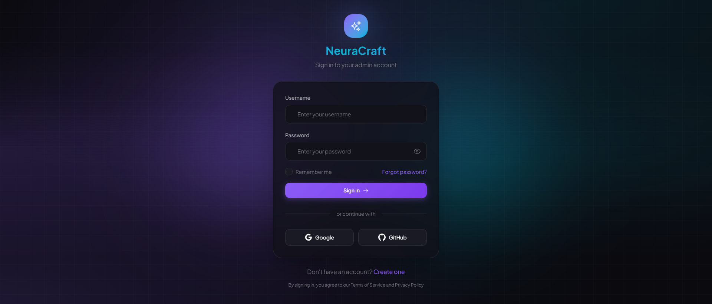

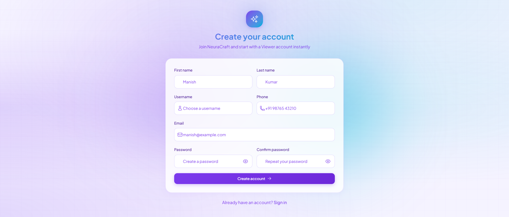

### Dashboard

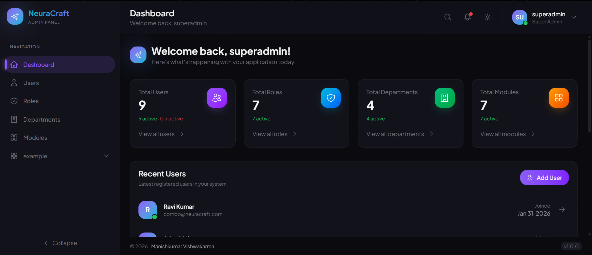

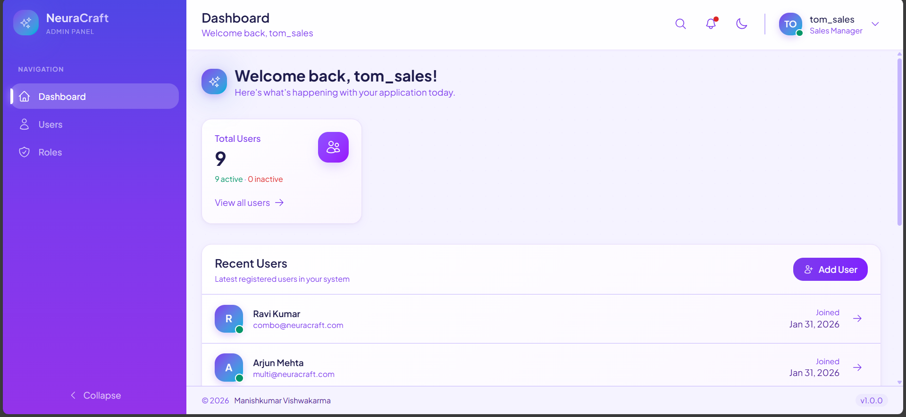

### Users

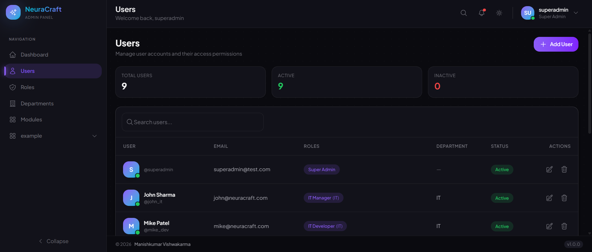

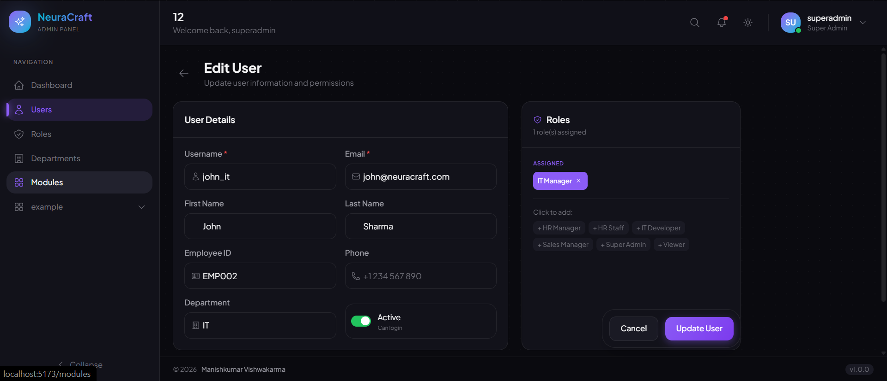

### Roles and Permissions

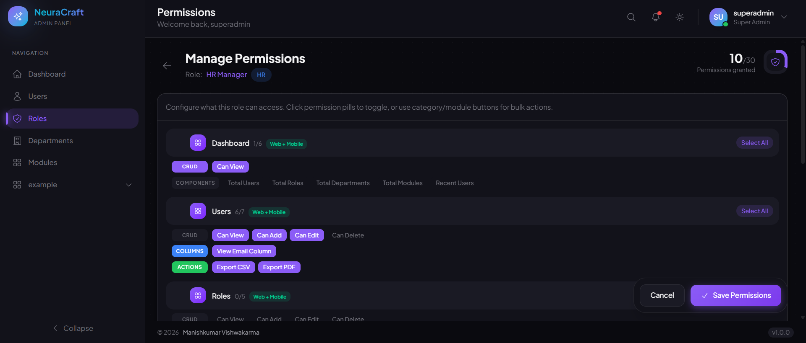

### Modules

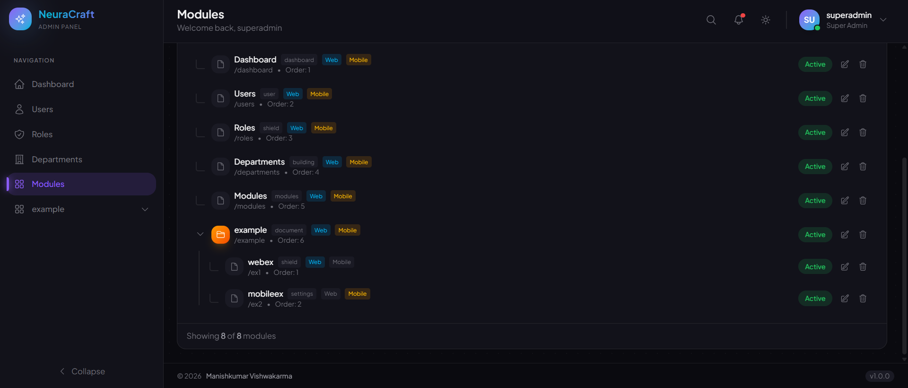

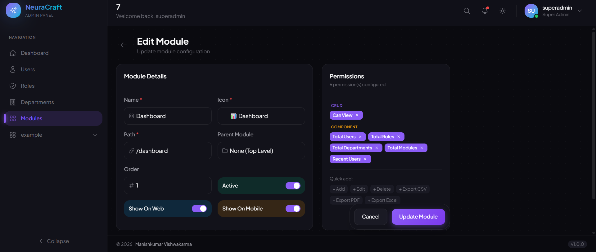

## Mobile Screenshots

### Login Page

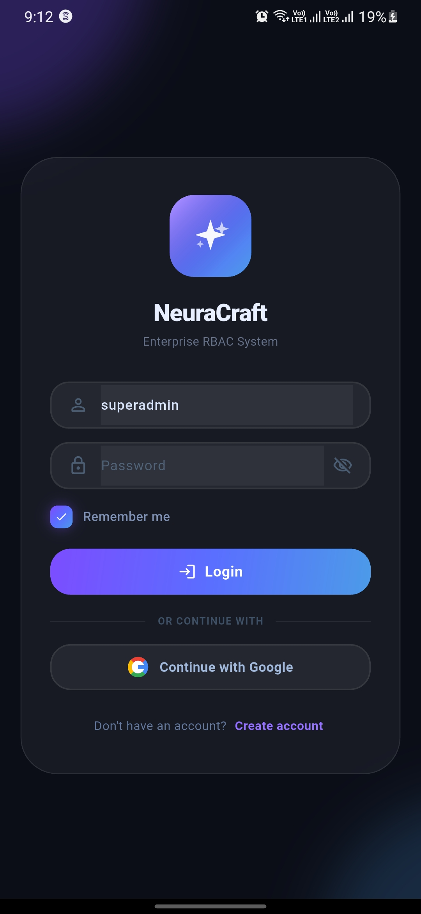

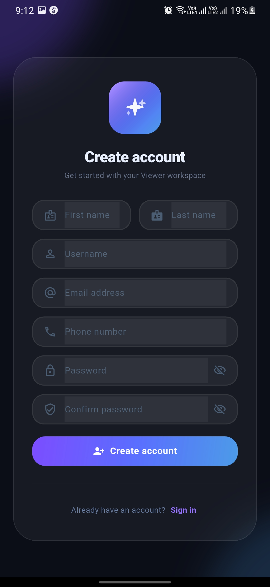

### Dashboard

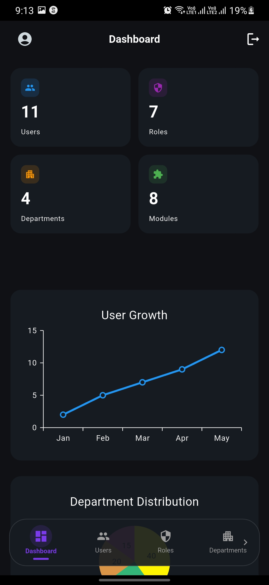

### Users

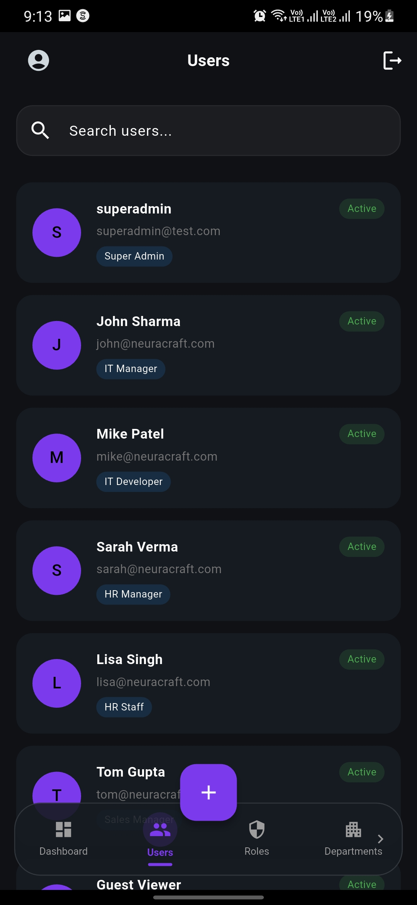

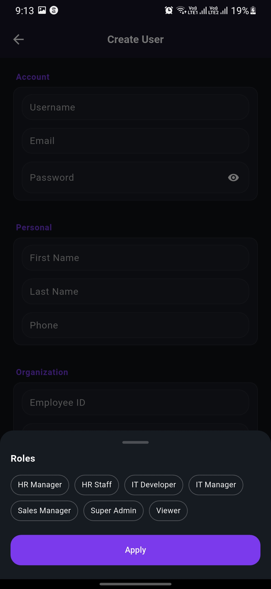

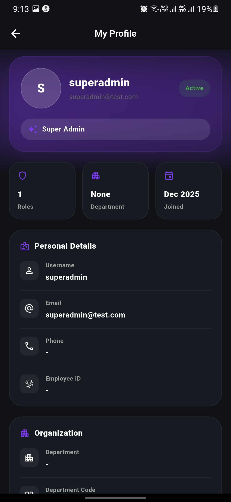

### Roles and Permissions

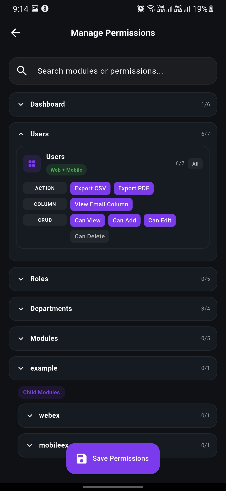

### Modules

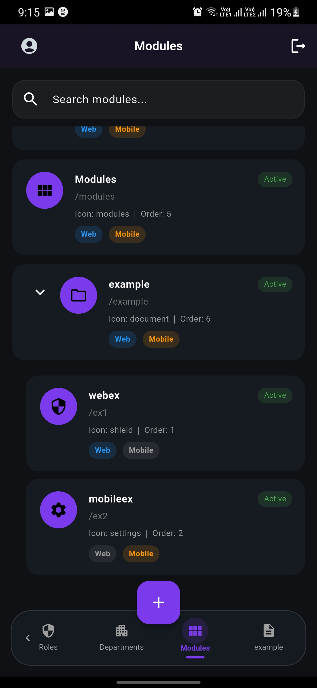

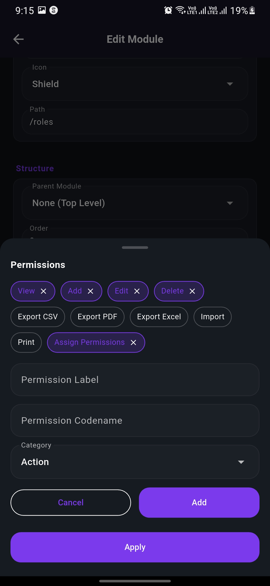

---

## Deployment Notes

- Backend dependencies include Gunicorn, WhiteNoise, `dj-database-url`, and `psycopg2-binary` for production deployment.
- A `Procfile` is included under `base_template`.
- Configure Django environment variables for production values such as `SECRET_KEY`, database URL, allowed hosts, CORS origins, and debug mode.
- The mobile app can target either the deployed API or a local development API by changing the Dio base URL.

---

## Roadmap

- [ ] Password reset via email
- [ ] Audit logs
- [ ] Advanced search and filters across list screens
- [ ] Pagination and server-side sorting improvements
- [ ] Export to CSV/Excel/PDF
- [ ] Automated backend, web, and mobile tests
- [ ] Docker Compose for local full-stack startup
- [ ] CI workflow for lint, build, and test

---

## Acknowledgments

- Manishkumar Vishwakarma - Project Founder and Developer
- AI Development Assistant
- Django and Django REST Framework
- React, TypeScript, and Vite
- Flutter and Dart
- Tailwind CSS

---

<div align="center">
  <p>Made with ❤️ and 🤖 AI</p>
  <p><strong>NeuraCraft</strong></p>
  <p>Crafted with full-stack engineering, mobile-first expansion, and AI-assisted development.</p>
</div>
